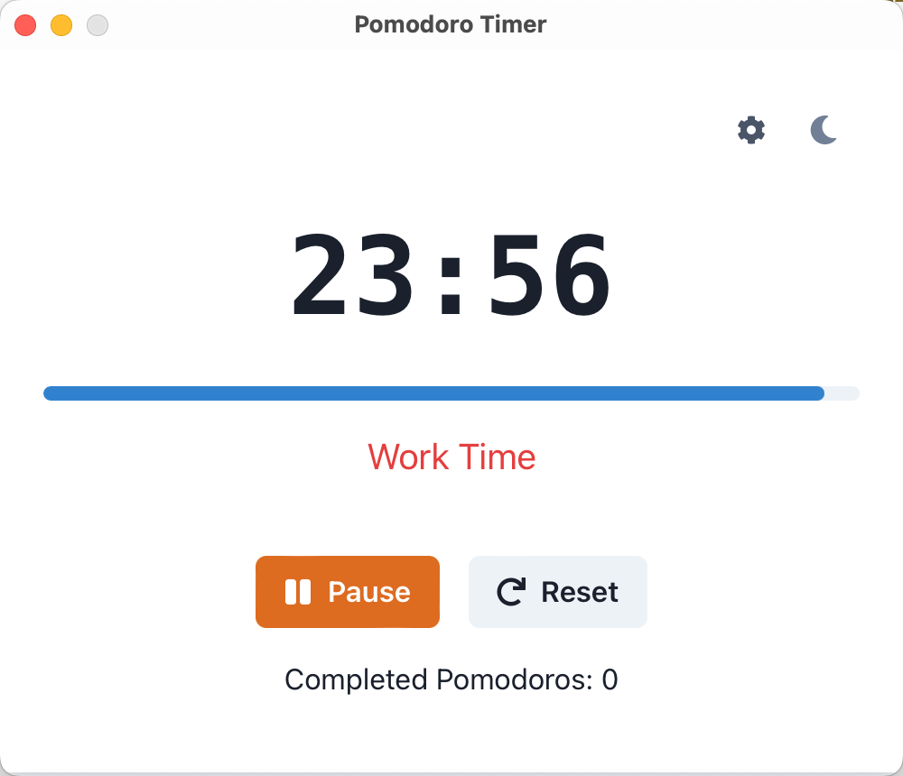
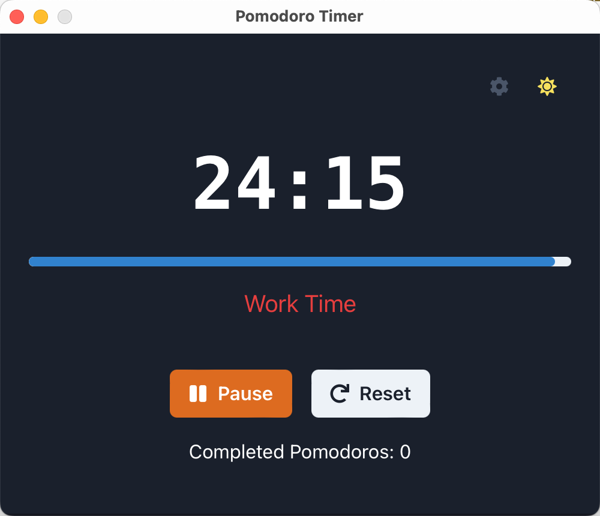

# Pomodoro Technique App

[English](README.md) | [简体中文](README.zh-CN.md)

A modern, cross-platform desktop application for time management using the Pomodoro Technique. Built with Tauri, React, and TypeScript.

<p align="center">
  
  
</p>

## Download App

[](https://github.com/dleged/pomodoro-technique-app/releases/)

## Features

- 🎯 Customizable work/break intervals
- 🔄 Automatic work/break cycle tracking
- 🌗 Dark/Light mode support
- 🔔 Native system notifications
- ⚡ Fast and lightweight
- 💻 Cross-platform support
- ⚙️ Easy-to-use settings panel

## Tech Stack

- **Frontend Framework**: React + TypeScript
- **UI Library**: Chakra UI
- **Desktop Framework**: Tauri
- **Build Tool**: Vite
- **State Management**: React Hooks
- **Notifications**: Tauri Notification Plugin

## Development

### Prerequisites

- Node.js (v16 or higher)
- Rust (latest stable)
- Platform-specific development dependencies:
  - **macOS**: Xcode Command Line Tools
  - **Windows**: Visual Studio and C++ build tools
  - **Linux**: Required system packages (varies by distribution)

### Setup

1. Clone the repository:
```bash
git clone https://github.com/yourusername/pomodoro-technique-app.git
cd pomodoro-technique-app
```

2. Install dependencies:
```bash
pnpm install
```

3. Run in development mode:
```bash
pnpm run tauri dev
```

### Building

To create a production build:
```bash
pnpm run tauri build
```

The built application will be available in the `src-tauri/target/release` directory.

## Project Structure

```
pomodoro-technique-app/
├── src/                      # React source files
│   ├── components/          # React components
│   ├── hooks/              # Custom React hooks
│   └── utils/              # Utility functions
├── src-tauri/              # Tauri backend
│   ├── src/               # Rust source code
│   └── tauri.conf.json    # Tauri configuration
├── public/                 # Static assets
└── package.json           # Project dependencies
```

## Features in Detail

### Timer Controls
- Start/Pause/Reset functionality
- Visual progress indicator
- Customizable time intervals

### Settings
- Adjustable work duration
- Configurable short break duration
- Customizable long break duration
- Settings persist between sessions

### [TODO] Notifications
- Native system notifications
- Break start/end alerts
- Permission handling

### Theme Support
- Automatic system theme detection
- Manual theme toggle
- Consistent styling across themes


## License

This project is licensed under the MIT License - see the [LICENSE](LICENSE) file for details.
