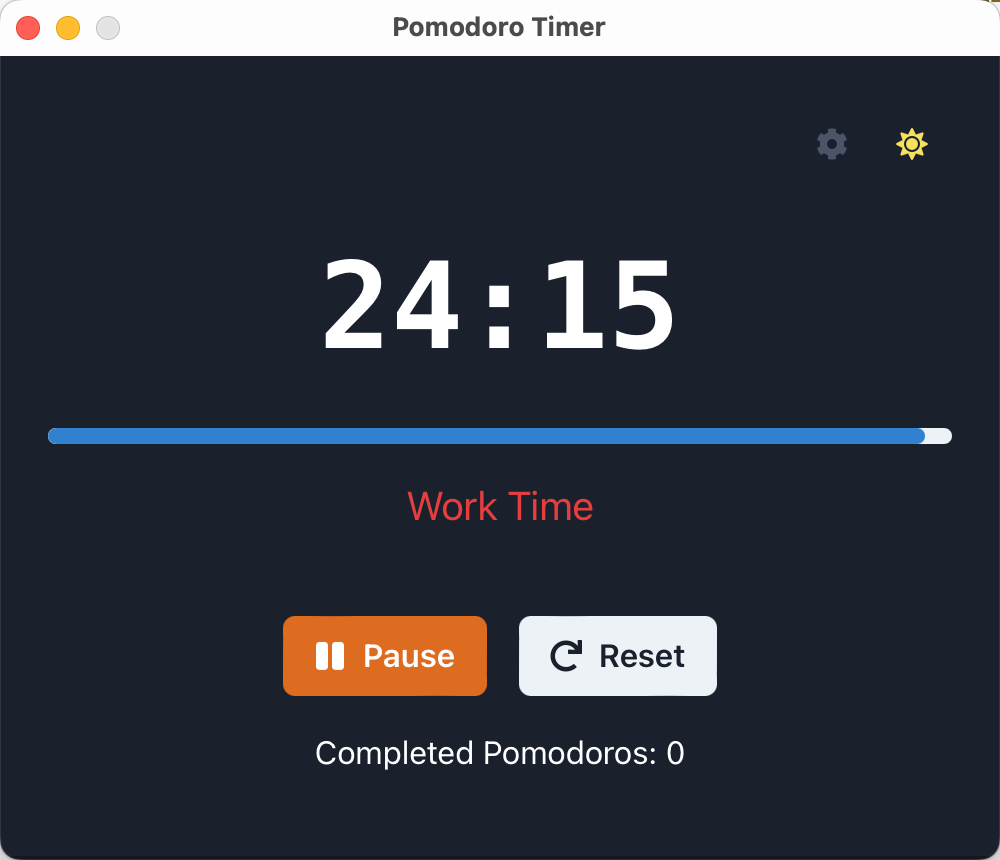

# 番茄工作法应用

[English](README.md) | [简体中文](README.zh-CN.md)

一个现代化的跨平台桌面应用，使用番茄工作法进行时间管理。基于 Tauri、React 和 TypeScript 构建。

<p align="center">
  
  
</p>

## 📥 下载应用

### 版本

请根据的操作系统在我们的 [这里下载](https://github.com/dleged/pomodoro-technique-app/releases) 选择适合的版本下载。

## 功能特点

- 🎯 可自定义工作/休息时间
- 🔄 自动工作/休息周期跟踪
- 🌗 深色/浅色主题支持
- 🔔 原生系统通知
- ⚡ 快速且轻量
- 💻 跨平台支持
- ⚙️ 简单易用的设置面板

## 技术栈

- **前端框架**: React + TypeScript
- **UI 库**: Chakra UI
- **桌面框架**: Tauri
- **构建工具**: Vite
- **状态管理**: React Hooks
- **通知系统**: Tauri Notification Plugin

## 开发指南

### 环境要求

- Node.js (v16 或更高)
- Rust (最新稳定版)
- 平台特定的开发依赖：
  - **macOS**: Xcode Command Line Tools
  - **Windows**: Visual Studio 和 C++ 构建工具
  - **Linux**: 所需系统包（因发行版而异）

### 安装步骤

1. 克隆仓库：
```bash
git clone https://github.com/yourusername/pomodoro-technique-app.git
cd pomodoro-technique-app
```

2. 安装依赖：
```bash
pnpm install
```

3. 运行开发模式：
```bash
pnpm run tauri dev
```

### 构建

创建生产版本：
```bash
pnpm run tauri build
```

构建完成的应用将位于 `src-tauri/target/release` 目录中。

## 项目结构

```
pomodoro-technique-app/
├── src/                      # React 源文件
│   ├── components/          # React 组件
│   ├── hooks/              # 自定义 React hooks
│   └── utils/              # 工具函数
├── src-tauri/              # Tauri 后端
│   ├── src/               # Rust 源代码
│   └── tauri.conf.json    # Tauri 配置
├── public/                 # 静态资源
└── package.json           # 项目依赖
```

## 功能详情

### 计时器控制
- 开始/暂停/重置功能
- 可视化进度指示器
- 可自定义时间间隔

### 设置
- 可调节工作时长
- 可配置短休息时长
- 可自定义长休息时长
- 设置在会话间保持

### [待开发] 通知
- 原生系统通知
- 休息开始/结束提醒
- 权限处理

### 主题支持
- 自动检测系统主题
- 手动主题切换
- 主题间一致的样式

## 许可证

本项目采用 MIT 许可证 - 详见 [LICENSE](LICENSE) 文件。
